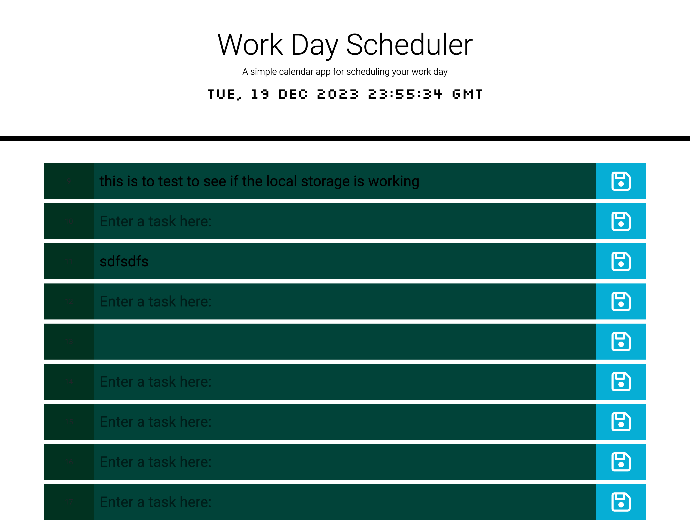

# Task Tracker App

## Overview

Task Tracker is a simple web application designed to help users manage their daily tasks efficiently. The app allows users to track tasks throughout the working day, from 9 AM to 5 PM. It leverages jQuery, dayjs, and CSS to provide a user-friendly interface for task management.

## Features

- **Task Tracking**: Easily input and track tasks for each hour of the day.
- **Local Storage Integration**: Your tasks are automatically saved to local storage, ensuring that you don't lose your progress even when you reload the page.
- **Color-Coded Rows**: Utilizes dayjs to color code rows based on whether tasks are in the past, present, or future, providing a visual cue for better organization.

## Getting Started

Follow these steps to get the Task Tracker app up and running on your local machine:

1. Clone the repository: `git clone [https://github.com/TimAtoyo/day-planner-app]`
2. Open the `index.html` file in your preferred web browser.

## Usage

1. Navigate to the Task Tracker app in your web browser.
### Live Demo

Check out the live demo of the Task Tracker app [here](https://timatoyo.github.io/day-planner-app/).

2. Input your tasks for each hour of the working day.
3. Tasks are automatically saved to local storage, allowing you to pick up where you left off even after reloading the page.

## Technologies Used

- jQuery
- dayjs
- CSS
- HTML

## All Image
## Screenshots

## Contribution

If you'd like to contribute to the project, follow these steps:

1. Fork the repository.
2. Create a new branch for your feature: `git checkout -b feature-name`
3. Commit your changes: `git commit -m 'Add a new feature'`
4. Push to the branch: `git push origin feature-name`
5. Create a pull request.

## License

This project is licensed under the [MIT License](LICENSE).

---

